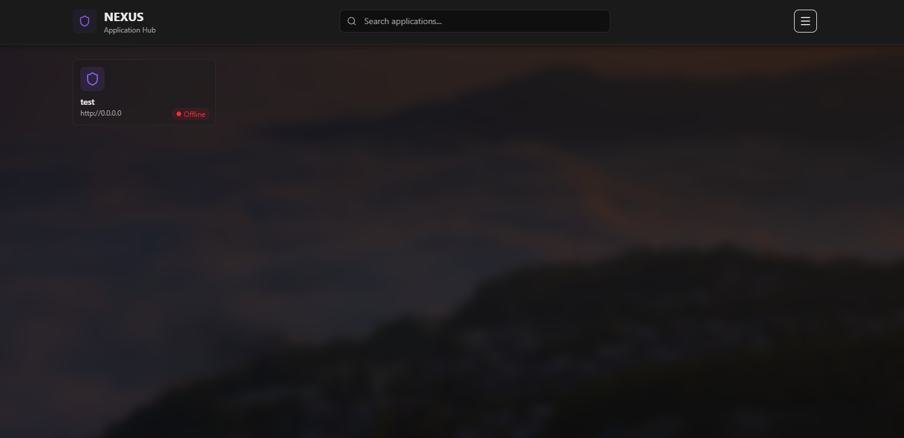

# NEXUS

> A modern, self-hosted authentication and application management hub for internal tools and services.



## ⚠️ Beta Status & Use Case

**NEXUS is currently in beta and designed for lightweight, internal deployments.**

This project is ideal for:

- Small to medium-sized teams (5-100 users)
- Internal tools and admin panels
- Homelab and self-hosted services
- Development/staging environments
- Non-critical applications

**Not recommended for:**

- Critical production systems requiring high availability
- Large-scale deployments (100+ concurrent users)
- Applications handling sensitive financial or health data
- Systems requiring SOC 2 compliance or similar certifications

## Overview

NEXUS is a centralized authentication system that provides single sign-on (SSO) for your internal applications. Built with Next.js 16, it offers a beautiful customizable dashboard, comprehensive admin controls, and easy integration with any web framework.

## ✨ Key Features

- **🔐 JWT-based Authentication** - Secure token-based auth with session management
- **🎨 Customizable Dashboard** - Personalize with colors, backgrounds, opacity, and favorites
- **👥 User Management** - Full admin portal with user CRUD and access control
- **🚀 Multi-Framework Support** - Next.js, Express, Flask, Go integration guides
- **📊 Access Matrix** - Visual overview of user-app permissions
- **🎨 Site-wide Branding** - Customize name, logo, colors across all pages
- **📝 Audit Logging** - Track all authentication and admin actions
- **💚 Health Monitoring** - Real-time status indicators for connected apps

## 🏃 Quick Start

### Prerequisites

- Node.js 18+
- npm, yarn, pnpm, or bun

### Installation

```bash
# Clone the repository
git clone https://github.com/bino97/nexus.git
cd nexus

# Install dependencies
npm install

# Set up environment variables
echo "NEXUS_JWT_SECRET=your-super-secret-jwt-key-change-this-in-production-minimum-32-characters" > .env.local

# Run the development server
npm run dev
```

### Access NEXUS

Open [http://localhost:4000](http://localhost:4000)

**Default credentials:**

- Username: `admin`
- Password: `admin` (you'll be prompted to change this on first login)

## 🔗 Integration

NEXUS works with any web framework that supports HTTP cookies and JWT verification.

### Quick Integration (Next.js)

```typescript
import { NextRequest, NextResponse } from "next/server";
import * as jose from "jose";

export async function middleware(request: NextRequest) {
  const token = request.cookies.get("nexus_token")?.value;

  if (!token) {
    return NextResponse.redirect(
      `${process.env.NEXUS_URL}/login?app=${process.env.NEXUS_APP_SLUG}`
    );
  }

  const secret = new TextEncoder().encode(process.env.JWT_SECRET);
  const { payload } = await jose.jwtVerify(token, secret);

  // Add user info to headers
  const requestHeaders = new Headers(request.headers);
  requestHeaders.set("x-user-id", payload.sub as string);

  return NextResponse.next({ request: { headers: requestHeaders } });
}
```

See the built-in documentation for **Express**, **Flask**, and **Go** examples (when running).

## 🗄️ Tech Stack

- **Framework:** Next.js 16 (App Router)
- **Database:** SQLite with better-sqlite3
- **Auth:** JWT tokens with jose
- **Styling:** Tailwind CSS v4
- **Icons:** lucide-react

## 📖 Documentation

- **[In-Depth README](INDEPTH_README.md)** - Comprehensive documentation
- **Integration Docs at /admin/docs** - Built-in integration guides (when running)

## 📝 License

This project is licensed under a **No-Resale Open Source License**.

✅ **You CAN:**

- Use NEXUS for **free** in your company or organization
- Use NEXUS for personal, educational, or commercial purposes
- Modify and customize the code for your needs
- Deploy NEXUS for internal authentication
- Share your modifications with others (under the same license)

❌ **You CANNOT:**

- **Sell or resell** NEXUS as a product
- Offer NEXUS as a **paid hosted/SaaS service**
- Repackage and sell NEXUS under a different name

**Example:** A startup can deploy NEXUS to manage authentication for their team at no cost. However, they cannot sell "NEXUS Pro" as a hosted authentication service to other companies.

See the [LICENSE](LICENSE) file for complete terms and conditions.

---

<p align="center">
  <strong>Made with ❤️ for internal tools everywhere</strong>
</p>
